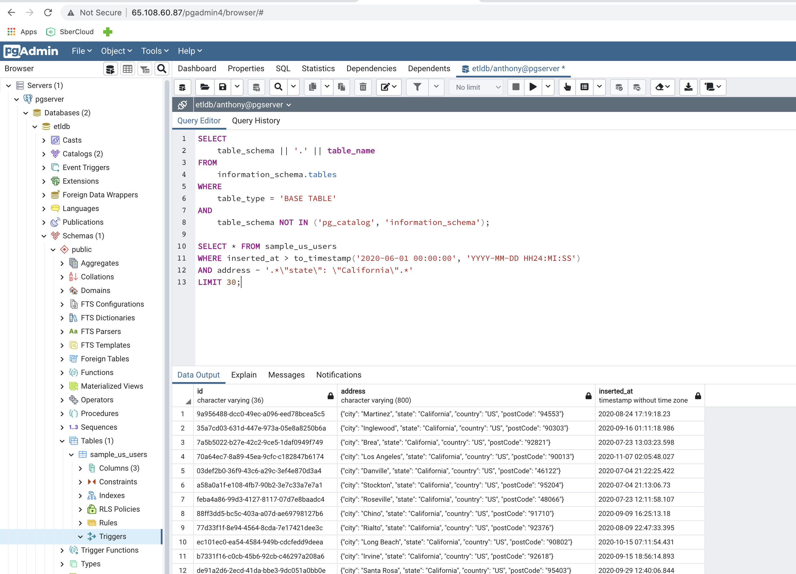

# ETL PyProject for NearRealTime(NRT) Data Stream Pipeline with PostGreSQL DB as backend and FastAPI with Async REST Endpoints

*PROJECT STRUCTURE*:
- `install_postgres.sh`: silent auto-installer `PostgreSQL` DB on Ubuntu (non-dockerized)
- `install_pgadmin.sh`: silent `pgadmin4` auto-installer on Ubuntu (non-dockerized)
- `redis2postgres_insert.py`: py-script with connection to Postgres and implemented parallel loading of data rows being fetched from Redis cache 
- `service.py`: MAIN `FastAPI` async service running under `uvicorn` `ASGI` Web server providing async endpoints to fetch/modify/delete rows from PostgreSQL 
- `run_pg.sh`:  dockerized script for installing and auto-configuring `PosrgreSQL` DB in Docker container 
- `run_pg_server_conf.sh`: shell script with `posrgres` configuration instructions that will be executed inside the running docker container 
- `run_serv.sh` : shell script for serving REST Endpoints under `Gunicorn` server producing load balancing with N workers and N threads  
- `/src/`
  - **./loader.py**: class with Postgres DB connection and build-in getter/loader methods for working with data rows 
  in parallel/nonparallel batch modes  

### Virtual Machines
Hosted virtual machines with installed databases (Redis/Postgres) and running microservises:

Here Redis DB is located on one remote host and PostgreSQL is located in another remote machine (postgres server can be running in relevant docker container or 
just simply installed on remote host as it's up to user).

### MAIN PROJECT DESCRIPTION
This project is considered as a continuation from previous implementation [RedisETL with Async FastAPI](https://github.com/antyan001/RedisETL) using predominately Redis DB for fast caching data at the backend.  
Hereafter we set up and run an instance of PostGres DB to catch data from key-val Redis cache and sore ones in prepared relation DB.

### Install PostgreSQL directly on user host (without Docker image)
Simply run shell script `install_postgres.sh`
Check the installation results by connecting to our DB name `etldb` with created user `anthony` having all grants as shown on the following picture: 
```postgresql
root@kcloud-production-user-136-vm-180:~/PostgresSQL# sudo -u postgres psql -c '\l'
                                  List of databases
   Name    |  Owner   | Encoding |   Collate   |    Ctype    |   Access privileges   
-----------+----------+----------+-------------+-------------+-----------------------
 etldb     | postgres | UTF8     | en_US.UTF-8 | en_US.UTF-8 | =Tc/postgres         +
           |          |          |             |             | postgres=CTc/postgres+
           |          |          |             |             | anthony=CTc/postgres
 postgres  | postgres | UTF8     | en_US.UTF-8 | en_US.UTF-8 | 
 template0 | postgres | UTF8     | en_US.UTF-8 | en_US.UTF-8 | =c/postgres          +
           |          |          |             |             | postgres=CTc/postgres
 template1 | postgres | UTF8     | en_US.UTF-8 | en_US.UTF-8 | =c/postgres          +
           |          |          |             |             | postgres=CTc/postgres
(4 rows)
```

### Dockerized installation of PostgreSQL on user host from Docker image
Simply run shell script `run_pg.sh` which uses instructions from inplace `Docker` file
Dive into running docker container (hereafter docker container is called `pg_image`) 
```python
docker_id="$(docker ps -a | grep -E "pg_image*" | awk '{print $1}' | xargs)"; docker exec -it $docker_id bash
```
Configure your `pg_hba.conf` file to resolve db connections from remote white hosts:
```sqlite
echo "listen_addresses = '*'" >> /etc/postgresql/12/main/postgresql.conf
echo "host    all             all             65.108.60.0/24          md5" >> /etc/postgresql/12/main/pg_hba.conf
echo "host    all             all             172.17.0.0/24           md5" >> /etc/postgresql/12/main/pg_hba.conf
```
Set executable permissions to file `redis2postgres_insert.py` and run script with appropriate flags 
for inserting data from Redis to Postgres: 
```python
root@2594b01cd3aa:/app# chmod u+x redis2postgres_insert.py
root@2594b01cd3aa:/app# ./redis2postgres_insert.py -table="$TBL0" --parallel=True
```
Main script `redis2postgres_insert.py` for communicating with PostGreSQL should be run in the following way:
```
./redis2postgres_insert.py -table=[TBL_NAME] -parallel=[True|False]
```
Appropriate variables `$TBL{}` with table names are declared in `config0.env` file. Run our loader in parallel mode and see output results: 
```python
root@2594b01cd3aa:/app# ./redis2postgres_insert.py -table="$TBL0" -parallel=True
2.9.3 (dt dec pq3 ext lo64)
('PostgreSQL 12.10 (Ubuntu 12.10-1.pgdg18.04+1) on x86_64-pc-linux-gnu, compiled by gcc (Ubuntu 7.5.0-3ubuntu1~18.04) 7.5.0, 64-bit',)
[Parallel(n_jobs=5)]: Using backend LokyBackend with 5 concurrent workers.
Pushed 508 lines 
Pushed 508 lines 
Pushed 508 lines 
Pushed 3 lines 
[Parallel(n_jobs=5)]: Done   4 out of   6 | elapsed:    3.4s remaining:    1.7s
Pushed 508 lines 
Pushed 508 lines 
[Parallel(n_jobs=5)]: Done   6 out of   6 | elapsed:    4.7s finished
```
### Data Loading process explanation.
Main class for PostgreSQL connection is implemented in script `loader.py`
```python
class PostGresDB(object):

    def __init__(self, user, password, database):
        self.user = user
        self.password = password
        self.database = database

    def connect(self):
        self.connection = psycopg2.connect(database=self.database,
                                           user=self.user,
                                           password=self.password,
                                           host="localhost",
                                           port="5432")

        self.cursor = self.connection.cursor()

    def close(self):
        self.cursor.close()
        self.connection.close()
```
Firstly we should fetch all rows inserted into Redis cache sending the next POST request to remote service:
* --> *[POST]*: `/getTopNFromReplica`
```python
import shlex
cmd = 'curl -i http://65.108.56.136:8003/getTopNFromReplica -X POST -d "?replica=sample_us_users&topn=-1"'
args = shlex.split(cmd)
process = subprocess.Popen(args, shell=False, stdout=subprocess.PIPE, stderr=subprocess.PIPE)
stdout, stderr = process.communicate()

out_str = stdout.decode("utf-8").split("content-type: application/json")[-1].strip()
redis_getter_data = json.loads(out_str)


{'ab5ee960-39fc-482c-93e5-806e071bffc4': ['{"city": "Charleston", "state": "West Virginia", "country": "US", "postCode": "29492"}',
  '2020-05-19 05:20:32.212'],
 '3d8f9a3c-fca1-436a-9563-b206f301720a': ['{"city": "Indianapolis", "state": "Indiana", "country": "US", "postCode": "46254"}',
  '2020-09-09 15:32:20.030'],
 '15006991-51ed-4a8c-8199-22e6bb7ec09e': ['{"city": "Redlands", "state": "California", "country": "US", "postCode": "92374"}',
  '2020-06-27 09:32:17.307'],
 '1550596b-170d-46e2-8071-627cba76be68': ['{"city": "Clackamas", "state": "Oregon", "country": "US", "postCode": "97015"}',
  '2020-04-28 14:25:03.103'],
 '7f74dffe-db3b-406e-b082-e8653af20c56': ['{"city": "Zachary", "state": "Louisiana", "country": "US", "postCode": "70791"}',
  '2020-08-07 00:48:29.969']}
```
Also we need a column names specification that could be obtained via calling the following endpoint: 
```shell script
import shlex
cmd = 'curl -i http://65.108.56.136:8003/getReplicaColumns -X POST -d "?replica=sample_us_users"'
args = shlex.split(cmd)
process = subprocess.Popen(args, shell=False, stdout=subprocess.PIPE, stderr=subprocess.PIPE)
stdout, stderr = process.communicate()

out_str = stdout.decode("utf-8").split("content-type: application/json")[-1].strip()
redis_getter_cols = json.loads(out_str)

['id', 'address', 'inserted_at']
```
Next steps are:
- Converting rows to pandas
- Find `DateTime` cols in String Notation and cast it to `DateTime` Type
    ```python
        ## Find DateTime col in String Notation and cast it to DateTime Type
        datetime_cols = []
        find_datetime = re.compile("\d{4}\-\d{2}\-\d{2}\s*\d{2}\:\d{2}\:\d{2}\.?\d{1,6}?")

        for col in df.columns:
            touch_df_rec = df[col][df[col].first_valid_index()]
            try:
                out = find_datetime.findall(touch_df_rec)
                if len(out) > 0:
                    datetime_cols.append(col)
            except:
                pass
  
        if len(datetime_cols) > 0:
        for col in datetime_cols:
            df[col] = df[col].apply(lambda x: pd.to_datetime(x))
    ``` 
- Replacing `np.NaT` with `None` (`psycopg2` driver didn't work with `NaT` cells):
    ```shell script
            ###########################################################################
            ## !!!!!!!!!!!!!!!!!!! REPLACING pd.NaT VALUES WITH None!!!!!!!!!!!!!!!!!##
            ###########################################################################
            for col in datetime_cols:
                df[col] = df[col].astype(object).where(df[col].notnull(), None)
                # df.replace({np.NaN: pd.to_datetime(NAT_SUBST_STR__)}, inplace = True)
                # df = df.replace({pd.NaT: None}).replace({np.NaN: None})
    ```
- *make type casting between pandas and Postgres*
- create empty table in user defined scheme
- run batch loading (parallel/nonparallel) using `psycopg2` driver:
    ```python
            if useParallelLoader:
                db = PostGresDB(user="anthony", password="lolkek123", database="etldb")
                loader.push_rows_parallel(db, df, TBL_NAME, num_partitions=5, njobs=5, verbose=True)
            else:
                ## NonParallelized Bulk Insertion into DB
                loader.db_insert_batch(cur, TBL_NAME, cols_lst, values_list)
                db.connection.commit()
    ```
Check that all rows are commited successully into user-defined scheme:
```python
root@2594b01cd3aa:/app# ./redis2postgres_insert.py -table="$TBL0" -parallel=True
2.9.3 (dt dec pq3 ext lo64)
('PostgreSQL 12.10 (Ubuntu 12.10-1.pgdg20.04+1) on x86_64-pc-linux-gnu, compiled by gcc (Ubuntu 9.3.0-17ubuntu1~20.04) 9.3.0, 64-bit',)
[Parallel(n_jobs=5)]: Using backend LokyBackend with 5 concurrent workers.
Pushed 999 lines 
Pushed 999 lines 
Pushed 999 lines 
Pushed 4 lines 
[Parallel(n_jobs=5)]: Done   4 out of   6 | elapsed:    2.5s remaining:    1.2s
Pushed 999 lines 
Pushed 999 lines 
[Parallel(n_jobs=5)]: Done   6 out of   6 | elapsed:    3.1s finished
                                     id                                            address             inserted_at
0  dc3c7f51-2ae0-40c6-88a0-84d74299bd4d  {"city": "Lincoln park", "state": "Michigan", ... 2020-08-05 21:14:33.994
1  d41459c4-92ae-46ed-a1c6-008e74a5186c  {"city": "Spring", "state": "Texas", "country"... 2020-11-25 16:55:37.199
2  ca005739-03ee-4993-bad0-0f311df1a29b  {"city": "Philadelphia", "state": "Pennsylvani... 2020-08-09 22:03:48.910
3  c6b52ccc-76bc-4ae7-a5e3-f755a74293d0  {"city": "Salisbury", "state": "North Carolina... 2020-06-01 23:20:31.093
4  4438a8eb-9e64-4405-a234-b3cc40a4b25d  {"city": "Lagrange", "state": "US-OUT", "count... 2020-08-15 23:13:51.984
```
Send signal to remove all records being successfully fetched and stored in Postgres DB:
* --> *[POST]*: `/clearRedisCache`
```python
# Send signal to clear Replica Cache in Redis
cmd = 'curl -i http://65.108.56.136:8003/clearRedisCache -X POST -d "?replica=sample_us_users&remove=True"'
args = shlex.split(cmd)
process = subprocess.Popen(args, shell=False, stdout=subprocess.PIPE, stderr=subprocess.PIPE)
stdout, stderr = process.communicate()
```
Wait for new data written to Redis cache and repeat all above-mentioned steps again.

## PostgreSQL monitoring: running Pgadmin on Virtual Server 
One can try to install pgAdmin in Ubuntu by running the following script: `install_pgadmin.sh`\
Next step is to configure and establish a connection to PostgreSQL via `pgadmin` GUI using created `$db_username` and `$db_password`.
We're talking about the user that was created at the final steps of Postgres configuration by running command\
`sudo su - postgres -c "createuser -P -s -e $db_username""`\
After all configuraiton steps are complited one can run some query in Postgres QEditor:
```sqlite
SELECT
    table_schema || '.' || table_name
FROM
    information_schema.tables
WHERE
    table_type = 'BASE TABLE'
AND
    table_schema NOT IN ('pg_catalog', 'information_schema');

SELECT * FROM  avatar_sample
WHERE recsys_digital_avatar_full_response_dttm > to_timestamp('2021-06-01 00:00:00', 
														      'YYYY-MM-DD HH24:MI:SS');
```


# Serving PostgreSQL Database with Dockerized Async REST API:
He we demonstrate the how to use developed Async CRUD (Create, Read, Update, and Delete) APIs using FastAPI functionality.\

- `API`:
    - `Dockerfile` 
    - `service.py`: MAIN FastAPI async service using `sqlalchemy` methods for communications with `posrgres` 
    (running under `gunicorn`) 
    - `run.sh` : bash script to build Docker image and start container 

To see the logs of running docker container just run to following inline command: 
```sqlite
docker ps -a | grep -E "sqlalch*" | awk '{print $1}' | xargs watch -n 2 docker logs
```

Fetch N rows from `sample_us_users` table uploaded at previous steps.
* --> *[GET]*: `http://65.108.60.87:8003/sample_us_users/?skip=0&take=5`
```python
cmd = 'curl -X GET http://65.108.60.87:8003/sample_us_users/?skip=0&take=5'
args = shlex.split(cmd)
process = subprocess.Popen(args, shell=False, stdout=subprocess.PIPE, stderr=subprocess.PIPE)
stdout, stderr = process.communicate()

out_str = stdout.decode("utf-8").split("content-type: application/json")[-1].strip()

json.loads(out_str)

[{'id': '3d4880db-8c73-4eb7-b0ec-d9c96d82dfab',
  'address': '{"city": "Sidney", "state": "Ohio", "country": "US", "postCode": "59270"}',
  'inserted_at': '2020-05-03T15:34:29.504000'},
 {'id': '472a0f40-fe20-4ee9-95aa-79cf5117f9ab',
  'address': '{"city": "Willingboro", "state": "New Jersey", "country": "US", "postCode": "08046"}',
  'inserted_at': '2020-03-14T23:41:04.324000'},
 {'id': '6338b020-b11f-491c-b1dc-5b3f8a980ef4',
  'address': '{"city": "Brenham", "state": "Texas", "country": "US", "postCode": "77833"}',
  'inserted_at': '2020-08-05T00:52:59.571000'},
 {'id': '6fe74d9f-5cb8-4be4-b02d-535df184fd63',
  'address': '{"city": "Addison", "state": "Illinois", "country": "US", "postCode": "60101"}',
  'inserted_at': '2019-05-07T18:14:56.131000'},
 {'id': 'd7c3e38c-77e2-4336-9803-cc264ee136c1',
  'address': '{"city": "Las Vegas", "state": "Nevada", "country": "US", "postCode": "89135"}',
  'inserted_at': '2020-06-01T21:35:16.507000'}]
``` 

Get a single Row given its Id via cURL using GET
* --> *[GET]*: `http://65.108.60.87:8003/sample_us_users/867a9975-cbd5-43dc-b3c9-49a4eddb870f/`
```python
cmd = 'curl -X GET http://65.108.60.87:8003/sample_us_users/867a9975-cbd5-43dc-b3c9-49a4eddb870f/'
args = shlex.split(cmd)
process = subprocess.Popen(args, shell=False, stdout=subprocess.PIPE, stderr=subprocess.PIPE)
stdout, stderr = process.communicate()

out_str = stdout.decode("utf-8").split("content-type: application/json")[-1].strip()

json.loads(out_str)

{'id': '867a9975-cbd5-43dc-b3c9-49a4eddb870f',
 'address': '{"city": "Riverdale", "state": "Georgia", "country": "US", "postCode": "30274"}',
 'inserted_at': '2020-07-15T16:57:53.897000'}
```

## GUNICORN support
Finally we used here a `GUNICORN` server for load balancing with 4 workers and 4 threads each with the full support of Graceful Shutdown and Graceful Reload.
Service side is propotyped on the base of: 
1. `Uvicorn` as ASGI web server implementation for Python.\
